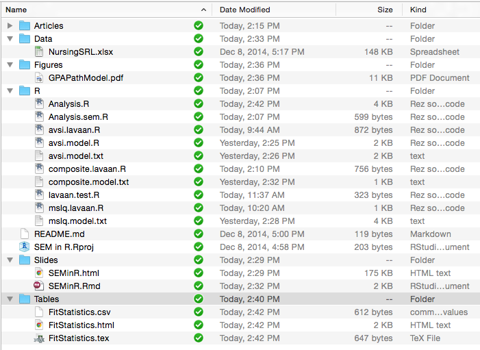

```{r setup, echo=FALSE, results='hide', message=FALSE, warning=FALSE}
library(irr)
library(gdata) # For loading Excel files
library(lavaan)
library(psych)
library(semPlot)
```

## Overview


## Data Preparation

The data for this example come from Nagelsmith, Bryer, and Yan (2012). It measures academic self-reguation, volitional control, and GPA for nursing students in an online college.

```{r}
srl <- read.xls('../Data/NursingSRL.xlsx', sheet=1)
names(srl)
```

## Instruments

Academic Volitional Strategies Inventory (AVSI) - 20 items measuring three factors:

* Stress Reducing Actions
* Negative-Based Incentives
* Self-Efficacy Enhancement

Motivated Strategies for Learning Questionnaire (MSLQ) - 31 items measuring six factors:

* Intrinsic Goal Orientation
* Task Value
* Test Anxiety
* Extrinsic Goal Orientation
* Control of Learning Beliefs
* Self-Efficacy

## File Structure



## References

Hooper, D., Coughlan, J., & Mullen, M.R. (2008). Structural equation modeling: Guidelines for determining model fit. *The Electronic Journal of Business Research Methods, 6*(1), 53-60.

Jöreskog, K., & Sörbom, D. (1993). *Lisrel 8: Structural Equation Modeling with the SIMPLIS Command Language.* Lincolnwood, IL: Scientific Software International, Inc.

Nagelsmith, L., Bryer, J., & Yan, Z. (2012). Measuring motivation and volition of nursing students in nontraditional learning environments. *Journal of Nursing Measurement, 20*(2), 90-112.

Rosseel, Y. (2012). `lavaan`: An R package for structural equation modeling. *Journal of Statstical Software, 48*(2).


